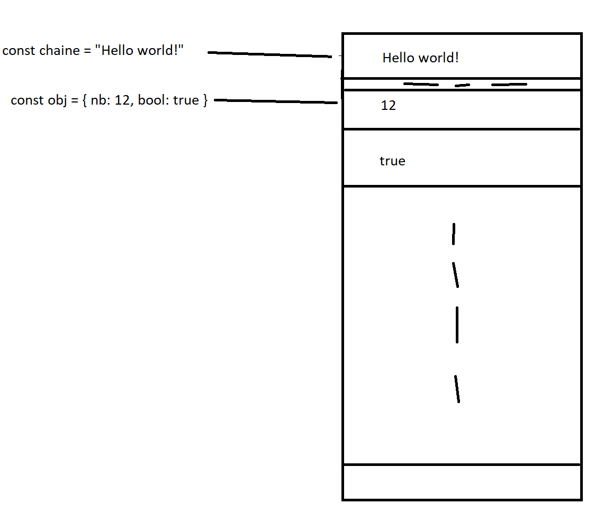

# Dimanche 5 Avril - JavaScript

## Récapitulatif

Pour intégrer un fichier JavaScript à une page HTML, il suffit d'ajouter une balise `<script src="main.js"></script>` tout en bas du `body`.

### Varibles

#### Type primitif

```js
const tata = 'cc'
const nombre = 23
const boolean = true // false
```

#### Type Objet

##### Objets

Un Objet est un ensemble clés/valeurs. Les valeurs peuvent être de type primitif ou objet.

```js
const object = {
  ma_cle: 'ma valeur',
  ma_dexuieme_cle: true,
  mon_object_imbrique: {
    toto: true,
  },
}
const config_ecran = {
  width: 1024,
  height: 800,
  browser: 'Mozilla 8.9',
}

console.log(config_ecran.browser) // 'Mozilla 8.9'
config_ecran.browser = 'Chrome' // Réaffectation de la clé `browser`
console.log(config_ecran.browser) // 'Chrome'
```

##### Tableaux

Un tableau est ensemble de valeurs. A la différence d'un objet, on accède pas à une valeur via une clé, mais par un indice.

**Attention:** Un tableau de taille `N` commence à l'index `0` et termine à l'index `N-1`

```js
const tableau = [12, 34, 'toto', true, { toto: 'tutu' }, [1, 2, 3]]

console.log(tableau[0]) // 12
console.log(tableau[5]) // [1, 2, 3]

// Réaffectation d'un élément du tableau
tableau[0] = 14

// Exemple tableau à deux dimensions
const matrice = [
  // A  B  C
  [1, 2, 3], // 1
  [4, 5, 6], // 2
  [7, 8, 9], // 3
]
console.log(matrice[1][1]) // 5
```

##### ATTENTION

Les types objets sont représentés en mémoire par des pointeurs. Une variables de type objet "pointe" vers une zone mémoire précise.

Ex: 

### Opérateurs

En JavaScript, il existe l'ensemble des opérateurs `>`, `>=`, `<`, `<=`, `==`, `!=`,**mais aussi** `===` et `!==`. Ces derniers servent à comparer la valeur ET le type.

```js
console.log('5' == 5) // true
console.log('5' === 5) // false

const obj1 = {
  toto: 'toto',
}
const obj2 = {
  toto: 'toto',
}
console.log(obj1 === obj1) // False car les deux objets pointent vers des adresses mémoire (RAM) différentes. On compare donc les adresses des pointeurs qui sont différentes.
```

### Conditions

#### Si, Sinon-Si, Sinon

```js
if (config_ecran.width >= 1000) {
  alert('Tu peux afficher mon site en grand écran!')
} else if (config_ecran.width > 600) {
  alert('tu es sur moyen ecarn')
} else {
  alert('autre résolution...')
}
```

#### Ternaires

```js
// Cas récurrent
let categorie = 0
if (config_ecran.width >= 1000) {
  categorie = 1
}

// Alernative
const categorie_2 = config_ecran.width >= 1000 ? 1 : 0 // En plus, pas besoin de déclarer un LET mais on peut directement faire un CONST
```

### Fonctions

```js
function sum(nb1, nb2) {
  return nb1 + nb2
}

const result = sum(1, 2)
console.log('Resultat vaut : ' + result) // 'Résultat vaut : 3'
```

```js
function checkScreenSize(width) {
  if (width >= 1000) {
    alert('Tu peux afficher mon site en grand écran!')
  } else if (width > 600) {
    alert('tu es sur moyen écran')
  } else {
    alert('autre résolution...')
  }
}

checkScreenSize(687) // ALERT 'tu es sur moyen écran'
```
